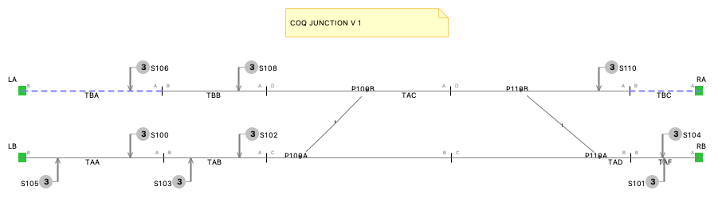

# SafeCap Coq formalisation

This repository contains various assets pertaining to the formalisation of SafeCap SSI interlocking verification using Coq proof assistant.

## Sample schema

As the basis we use the following schema:

The bottom line is signalled in both directions and the top line only in `UP` (left to right) direction. 

There are four point machines but only two points as physical points are summated to form merged points:

* `P100A` and `P100B` summated to form `P100`;
* `P110A` and `P110B` summated to form `P110`.

These means that `P100A` and `P100B`, and, separately, P110A` and `P110B`, are always either normal or reverse at the same time.

A slight complication is added in the form of two alternate paths between signals `S101` and `S103` - there are defined routes for the direct path along bottom line and a path going into top line and then coming down. These could require some relatively interesting opposing locking conditions.

## Sample schema data

The schema is accompanied by three files:

* `schema/route.csv` is the route definition table, as imported into SafeCap to build routes;
* `schema/schema.csv` is CSV export of the schema graph to interchange with other tools
* `schema/context.b` is a conceptual representation of the schema as B Method context file.

## Interlocking data

SSI interlocking data is found in folder 'data'. It is split it several files:

* `ELT` timers file (empty for now),
* `FLG` flag identities that right now defines only sub routes,
* `FOP` sub and sub overal release predicates; for now just sub route release logic for several sub routes,
* `IPT` input telegram processing, empty for now,
* `OPT` output telegram processing, shall ignore as it has lots of unique syntax and requires multi-pass parsing,
* `PFM` point free to move conditions, populated,
* `PRR` route request blocks for several routes,
* `QST`, `ROU`, `SIG`, and `TCS` are identity definition files for route requests, routes, signals, and tracks (ambits).

## Properties

See [properties](properties/properties.md) for a number of sample properties.

## Transition system

See [route requests](transition_system/routes.md) files details of symbolic state transitions for the few defined routes.
